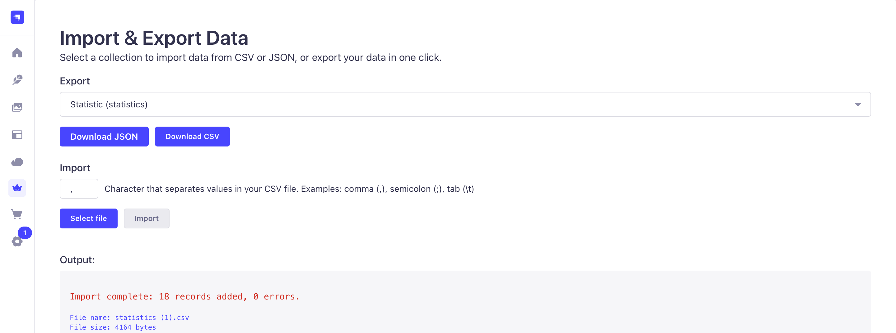

# Tablify

CSV/JSON Import & Export plugin for Strapi 5.

Tablify lets you import and export data from any Strapi collection in CSV or JSON format.

Features:

- Import data from CSV and JSON
- Export collections to CSV and JSON
- Works in Strapi admin panel
- For Strapi 5.x

Installation:
npm install strapi-plugin-tablify

# or

yarn add strapi-plugin-tablify

Usage:

1. Open the Tablify section in Strapi admin.
2. Choose a collection to import or export.
3. Follow the instructions.

Screenshots:

License: MIT
